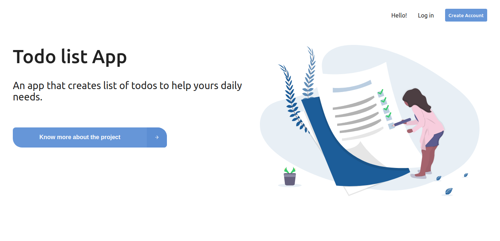
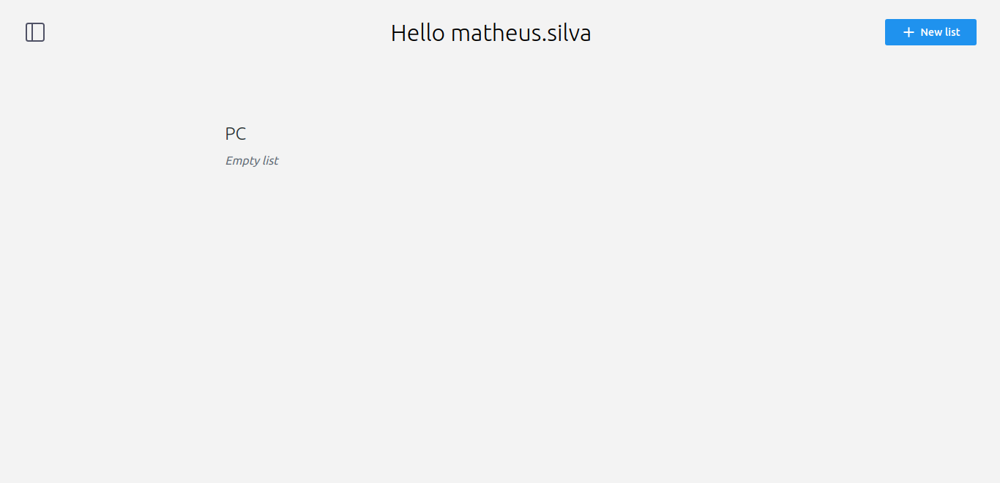
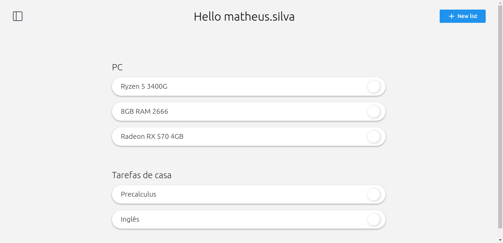
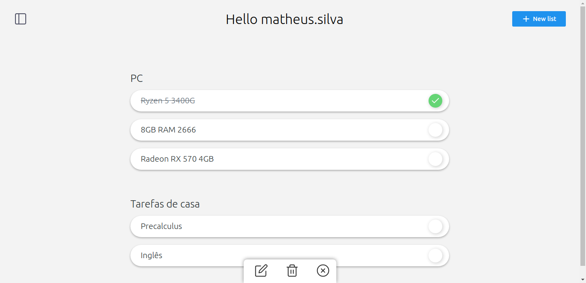

<h1 align='center'>Todo list with React and Node</h1>

<p align='center'>
	
	
	
</p>

<p>
Esse é uma aplicação web para testar os últimos conteúdos estudados e desafiar novos limites.
</p>

<h3 align='center'>
	:heavy_check_mark:
	Projeto Concluído 
	:heavy_check_mark:
</h3>

## :point_right: Tabela de conteúdos
   * [Tecnologias](#tecnologias)
   * [Como usar](#como-usar)
      * [Pré-Requisitos](#pre-requisitos)
      * [Rodando o Back End](#backend)
      * [Rodando o Front End](#frontend)
   * [Screenshots](#screenshots)
   * [Licença](#licenca)

<h2 id='tecnologias'> :point_right: Tecnologias</h2>

As seguintes ferramentas foram utilizadas na construção do projeto: 

<ul>
   <li>
      <a href='https://reactjs.org'>ReactJS</a>   
   </li>
   <li>
      <a href='https://nodejs.org/'>NodeJS</a>
   </li>
	 <li>
      <a href='https://mongodb.com'>MongoDB</a>   
   </li>
</ul>

<h2 id='como-usar'> :point_right: Como usar</h2>

<h3 id='pre-requisitos'> :point_right: Pré requisitos</h3>

Você vai precisar ter instalado em sua máquina as seguintes ferramentas: [Git](https://git-scm.com/), [Node.js](https://nodejs.org/en/), [Yarn](https://yarnpkg.com/) e [MongoDB](https://https://docs.mongodb.com/manual/installation/)

<h3 id='environment'> :point_right: Configurando o ambiente </h3>

<p>Vá até o arquivo .env.sample na pasta server e coloque suas próprias informações de ambiente, depois renomeie o arquivo para .env.</p>

```
JWT_PRIVATE_KEY=Your_private_key

DB_NAME=Your_database_name
DB_HOST=Your_database_host

API_PORT=The_port_you_want_that_the_api_runs (optional; default:9000)
```

<p>Vá até o arquivo .env.sample na pasta client e coloque suas próprias informações de ambiente, depois renomeie o arquivo para .env.</p>

```
REACT_APP_API_URL=Your_api_url
(remembers: the port here must be the same that .env in server folder)
```


<h3 id='backend'> :point_right: Rodando o Back End (Servidor)</h3>

```bash
# Clone este repositório
$ git clone https://github.com/MatheusOliveiraSilva/todo-list-react-node.git

# Acesse a pasto do projeto no terminal/cmd
$ cd todo-list-react-node

# Vá para a pasta server
$ cd server

# Instale as dependências
$ yarn install

# Execute a aplicação em modo de desenvolvimento
$ yarn dev

# O servidor iniciará na porta 9000
```

<h3 id='frontend'> :point_right: Rodando no Front End (Cliente)</h3>

```bash
# Clone este repositório
$ git clone https://github.com/MatheusOliveiraSilva/todo-list-react-node.git

# Acesse a pasto do projeto no terminal/cmd
$ cd todo-list-react-node

# Vá para a pasta server
$ cd client

# Instale as dependências
$ yarn install

# Execute a aplicação em modo de desenvolvimento
$ yarn start

# O servidor iniciará na porta 4000
```

<h2 id='screenshot'> :point_right: Screenshots</h2>






<h2 id='licenca'> :point_right: Licença</h2>

Esse projeto está sobre a licença [MIT](https://opensource.org/licenses/MIT)
